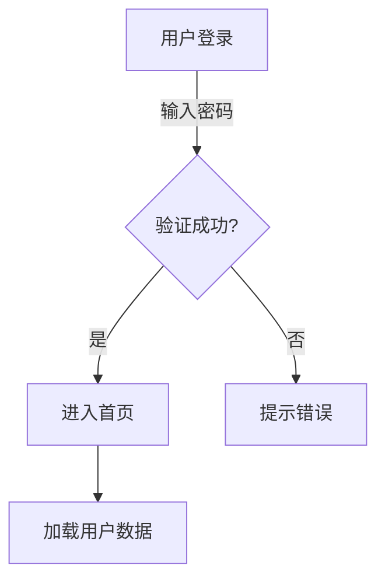
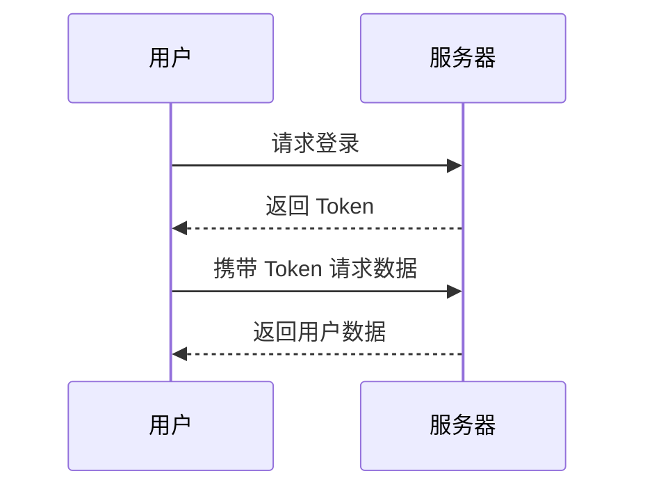

# 让 VitePress 文档“图文并茂”的魔法插件：vitepress-plugin-legend

> “写文档最怕什么？不是写不出来，而是**字太多，图太少，别人根本看不懂**！”

如果你正在用 VitePress 写技术文档，一定遇到过这样的场景：

- **需求评审**时，你画了一张巨复杂的流程图，结果文档里只能贴一张静态图片，放大看不清，缩小看不清，设计同学还嫌丑。
- **技术方案**里，你写了一长串 Markdown 列表，结果同事嫌太长，说“能不能画个脑图？”
- **周报**里，你写了 3000 字，结果隔壁组只看了 30 字，还问你“这个功能到底怎么实现的？”

别慌！今天给大家分享一个 VitePress 插件，**3 分钟让你的文档“图文并茂”**，还支持 **交互式脑图 + Mermaid 图表**，同事看完都说香！

**GitHub 地址**：<https://github.com/flingyp/vitepress-plugin-legend>

---

## 🎨 效果预览：文档瞬间“活”了！

先看效果，再学怎么用！

### 🧠 Markmap：一键生成可折叠脑图

写 Markdown 列表，自动生成可折叠的脑图，支持缩放、拖拽、折叠节点：

```text
# 前端性能优化
## 网络优化
- CDN 加速
- 资源压缩
## 渲染优化
- 虚拟滚动
- 懒加载
## 缓存优化
- Service Worker
- HTTP 缓存
```

```markmap
# 前端性能优化
## 网络优化
- CDN 加速
- 资源压缩
## 渲染优化
- 虚拟滚动
- 懒加载
## 缓存优化
- Service Worker
- HTTP 缓存
```

### 📊 Mermaid：流程图/时序图/甘特图，一键搞定

写 Mermaid 语法，自动生成可交互的图表，支持点击节点跳转：

```text
graph TD
    A[用户登录] -->|输入密码| B{验证成功?}
    B -->|是| C[进入首页]
    B -->|否| D[提示错误]
    C --> E[加载用户数据]
```



---

## 🚀 3 分钟上手：从 0 到图文并茂

### 1️⃣ 安装插件

```bash
npm install vitepress-plugin-legend
# 或
pnpm add vitepress-plugin-legend
# 或
yarn add vitepress-plugin-legend
```

### 2️⃣ 配置 VitePress

**修改 `.vitepress/config.ts`：**

```ts
import { defineConfig } from 'vitepress';
import { vitepressPluginLegend } from 'vitepress-plugin-legend';

export default defineConfig({
  markdown: {
    config(md) {
      vitepressPluginLegend(md, {
        markmap: { showToolbar: true }, // 显示脑图工具栏
        mermaid: true, // 启用 Mermaid
      });
    },
  },
});
```

**修改 `.vitepress/theme/index.ts`：**

```ts
import type { Theme } from 'vitepress';
import DefaultTheme from 'vitepress/theme';
import { initComponent } from 'vitepress-plugin-legend/component';
import 'vitepress-plugin-legend/dist/index.css';

export default {
  extends: DefaultTheme,
  enhanceApp({ app }) {
    initComponent(app);
  },
} satisfies Theme;
```

### 3️⃣ 在 Markdown 里写图表

**脑图（Markmap）：**

````markdown
```markmap
# 前端面试
## HTML
- 语义化标签
- SEO 优化
## CSS
- Flex 布局
- Grid 布局
## JavaScript
- 闭包
- 事件循环
```
````

**流程图（Mermaid）：**

````markdown

````

---

## 🎭 高阶玩法：组件化调用

除了代码块，你还可以用 **Vue 组件** 引入外部图表文件：

```markdown
<!-- 引入外部脑图 -->
<PreviewMarkmapPath path="./mindmap.md" showToolbar />

<!-- 引入外部 Mermaid 文件 -->
<PreviewMermaidPath path="./flowchart.mmd" />
```

---

## 🌈 真实案例：保存 AI 生成的图表，终于不用截图了！

以前每次用 ChatGPT / Claude 帮我写完技术方案，里面附带的 Mermaid 流程图我都得：

- 手动复制代码 → 新建 `.mmd` 文件 → 粘贴 → 保存
- 或者截图 → 丢进目录 → 起名字 → 再引用

**重复 10086 次后，我悟了：为什么不能在 Vitepress 直接预览它呢？**

---

## 🎁 彩蛋：3 个隐藏小技巧

1.  **暗黑模式适配**：插件自动适配 VitePress 的暗黑模式，图表颜色也会变！
2.  **响应式**：手机端也能完美显示，地铁上也能看图。
3.  **TypeScript 友好**：全量类型提示，写配置不踩坑。

---

## 📌 总结：写文档，别折磨读者！

vitepress-plugin-legend 不是“炫技”，而是 **让文档更易读**：

- **脑图**：适合梳理复杂逻辑（技术方案、面试题）
- **Mermaid**：适合展示流程（登录流程、部署流程）

**GitHub 地址**：<https://github.com/flingyp/vitepress-plugin-legend>

**最后的温柔请求**：如果它帮你省下了哪怕 1 分钟，去 GitHub 点个 Star 吧——让作者也感受下“有用”的实感。
